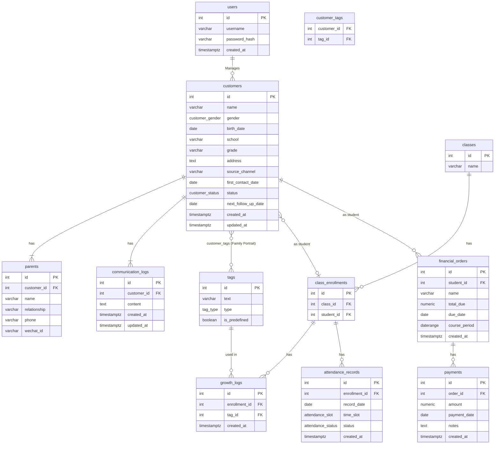

# 数据库设计蓝图与数据流转

本文档详细阐述了应用的数据库结构，基于PostgreSQL范式设计，并解释了核心业务的数据流转过程。

## 1. 核心设计理念

1.  **客户为中心 (Customer-Centric):** `customers` 表是整个系统的核心。一个实体从最初的“潜在客户”到最终的“已报名学生”，其身份通过 `status` 字段的改变来体现，而不是通过在不同表之间迁移数据。这确保了数据的一致性和完整性。
2.  **状态驱动 (State-Driven):** 应用的各个模块（CRM、学生日志、财务）通过查询 `customers` 表的不同 `status` 来获取各自所需的数据列表。
3.  **标签化与可扩展 (Tagging & Extensibility):** 所有的标签（家庭画像、成长日志）都被存放在一个统一的 `tags` 表中，通过 `type` 字段进行区分，并通过中间表与客户关联。这使得未来增加新的标签类型或预设标签变得非常容易。

## 2. 数据库实体关系图 (ERD - Mermaid)



## 3. 表结构定义 (PostgreSQL)

### 3.1 自定义枚举类型 (ENUMs)
为了数据一致性，我们首先定义枚举类型。

```sql
CREATE TYPE customer_status AS ENUM (
    '潜在用户', '初步沟通', '意向用户', '试课', '报名', '流失客户'
);

CREATE TYPE customer_gender AS ENUM ('男', '女', '其他');

CREATE TYPE tag_type AS ENUM (
    'family_job', 'family_income', 'family_education_concept',
    'family_focus', 'family_role', 'child_personality',
    'child_academic_level', 'child_discipline',
    'growth_positive', 'growth_negative'
);

CREATE TYPE attendance_status AS ENUM ('已到', '迟到', '请假', '未到');
CREATE TYPE attendance_slot AS ENUM ('am', 'pm');
```

### 3.2 表格 Schema

**1. `users`** - 系统操作员 (老师, 管理员)
```sql
CREATE TABLE users (
    id SERIAL PRIMARY KEY,
    username VARCHAR(255) UNIQUE NOT NULL,
    password_hash VARCHAR(255) NOT NULL,
    email VARCHAR(255) UNIQUE,
    phone VARCHAR(50),
    created_at TIMESTAMPTZ DEFAULT now()
);
```

**2. `customers`** - 核心表，涵盖潜在客户和已报名学生
```sql
CREATE TABLE customers (
    id SERIAL PRIMARY KEY,
    name VARCHAR(255) NOT NULL,
    gender customer_gender,
    birth_date DATE,
    school VARCHAR(255),
    grade VARCHAR(50),
    address TEXT,
    source_channel VARCHAR(255),
    first_contact_date DATE,
    status customer_status NOT NULL DEFAULT '潜在用户',
    next_follow_up_date DATE,
    created_at TIMESTAMPTZ DEFAULT now(),
    updated_at TIMESTAMPTZ
);
```

**3. `parents`** - 客户的家长信息 (一对多)
```sql
CREATE TABLE parents (
    id SERIAL PRIMARY KEY,
    customer_id INT REFERENCES customers(id) ON DELETE CASCADE,
    name VARCHAR(255) NOT NULL,
    relationship VARCHAR(100),
    phone VARCHAR(50),
    wechat_id VARCHAR(255)
);
```

**4. `communication_logs`** - 沟通纪要
```sql
CREATE TABLE communication_logs (
    id SERIAL PRIMARY KEY,
    customer_id INT REFERENCES customers(id) ON DELETE CASCADE,
    content TEXT NOT NULL,
    created_at TIMESTAMPTZ DEFAULT now(),
    updated_at TIMESTAMPTZ
);
```

**5. `tags`** - 所有标签的中央仓库
```sql
CREATE TABLE tags (
    id SERIAL PRIMARY KEY,
    text VARCHAR(255) NOT NULL,
    type tag_type NOT NULL,
    is_predefined BOOLEAN NOT NULL DEFAULT true,
    UNIQUE(text, type)
);
```

**6. `customer_tags`** - 客户与家庭画像标签的关联表 (多对多)
```sql
CREATE TABLE customer_tags (
    customer_id INT REFERENCES customers(id) ON DELETE CASCADE,
    tag_id INT REFERENCES tags(id) ON DELETE CASCADE,
    PRIMARY KEY (customer_id, tag_id)
);
```

**7. `classes`** - 班级
```sql
CREATE TABLE classes (
    id SERIAL PRIMARY KEY,
    name VARCHAR(255) NOT NULL UNIQUE
);
```

**8. `class_enrollments`** - 学生与班级的关联表 (多对多)
```sql
CREATE TABLE class_enrollments (
    id SERIAL PRIMARY KEY,
    class_id INT REFERENCES classes(id) ON DELETE CASCADE,
    student_id INT REFERENCES customers(id) ON DELETE CASCADE,
    enrollment_date DATE DEFAULT now(),
    UNIQUE(class_id, student_id)
);
```

**9. `growth_logs`** - 学生成长标签记录
```sql
CREATE TABLE growth_logs (
    id SERIAL PRIMARY KEY,
    enrollment_id INT REFERENCES class_enrollments(id) ON DELETE CASCADE,
    tag_id INT REFERENCES tags(id) ON DELETE CASCADE,
    created_at TIMESTAMPTZ DEFAULT now()
);
```

**10. `attendance_records`** - 学生考勤记录
```sql
CREATE TABLE attendance_records (
    id SERIAL PRIMARY KEY,
    enrollment_id INT REFERENCES class_enrollments(id) ON DELETE CASCADE,
    record_date DATE NOT NULL,
    time_slot attendance_slot NOT NULL,
    status attendance_status NOT NULL,
    created_at TIMESTAMPTZ DEFAULT now(),
    UNIQUE(enrollment_id, record_date, time_slot)
);
```

**11. `financial_orders`** - 财务订单
```sql
CREATE TABLE financial_orders (
    id SERIAL PRIMARY KEY,
    student_id INT REFERENCES customers(id) ON DELETE CASCADE,
    name VARCHAR(255) NOT NULL,
    total_due NUMERIC(10, 2) NOT NULL,
    course_period DATERANGE,
    due_date DATE,
    created_at TIMESTAMPTZ DEFAULT now()
);
```

**12. `payments`** - 收款记录 (一对多)
```sql
CREATE TABLE payments (
    id SERIAL PRIMARY KEY,
    order_id INT REFERENCES financial_orders(id) ON DELETE CASCADE,
    amount NUMERIC(10, 2) NOT NULL,
    payment_date DATE NOT NULL,
    notes TEXT,
    created_at TIMESTAMPTZ DEFAULT now()
);
```

## 4. 核心数据流转

1.  **潜在客户录入:**
    *   在CRM模块中创建一个新的 `customers` 记录，初始 `status` 为 '潜在用户'。
    *   同时可以创建关联的 `parents` 记录，并通过 `customer_tags` 添加家庭画像标签。
    *   每一次跟进，都在 `communication_logs` 中添加一条新记录。

2.  **客户转化 -> 学生:**
    *   当客户决定报名，在CRM看板上将其拖拽或标记为“报名”时，系统 **仅需要更新** 该 `customers` 记录的 `status` 字段为 '报名'。
    *   **关键点:** 无需数据迁移。这个 `customer` 记录现在就是一个“学生”了。

3.  **学生数据填充:**
    *   **学生日志模块:**
        *   当一个 `customer` 的 `status` 为 '报名' 时，他/她才会出现在“学生成长日志”模块的“可添加学生”列表中。
        *   将其添加到某个班级时，系统会在 `class_enrollments` 中创建一条关联记录。
        *   日常考勤，是在 `attendance_records` 中创建记录，并关联到 `class_enrollments`。
        *   添加成长标签，是在 `growth_logs` 中创建记录。
    *   **财务模块:**
        *   当一个 `customer` 的 `status` 为 '报名' 时，他/她才会出现在“财务中心”的学生列表中。
        *   为他/她创建订单，是在 `financial_orders` 中添加一条记录，`student_id` 就是这个 `customer` 的ID。
        *   添加收款记录，则是在 `payments` 中添加记录，并关联到 `financial_orders`。

4.  **仪表盘数据聚合:**
    *   **财务速览:** 通过对 `financial_orders` 和 `payments` 表进行聚合查询（SUM, GROUP BY）来计算“本月实收”、“本月应收”等指标。
    *   **待办提醒:** 直接查询 `customers` 表中 `next_follow_up_date` 为今天的记录。

## 5. 预设标签初始化数据

这些数据需要在系统首次部署时插入到 `tags` 表中。

```sql
-- 家庭画像标签
INSERT INTO tags (text, type, is_predefined) VALUES
('全职妈妈', 'family_job', true), ('双职工家庭', 'family_job', true), ('自由职业', 'family_job', true), ('企业高管', 'family_job', true), ('公务员', 'family_job', true),
('中等收入', 'family_income', true), ('高收入', 'family_income', true), ('经济压力较大', 'family_income', true),
('应试导向', 'family_education_concept', true), ('素质教育', 'family_education_concept', true), ('兴趣优先', 'family_education_concept', true), ('重视全面发展', 'family_education_concept', true),
('成绩提升', 'family_focus', true), ('习惯养成', 'family_focus', true), ('心理健康', 'family_focus', true), ('特长发展', 'family_focus', true),
('母亲主导', 'family_role', true), ('父亲主导', 'family_role', true), ('父母平衡', 'family_role', true), ('隔代抚养', 'family_role', true),
('外向', 'child_personality', true), ('内向', 'child_personality', true), ('敏感', 'child_personality', true), ('独立', 'child_personality', true), ('依赖', 'child_personality', true),
('优异', 'child_academic_level', true), ('中等', 'child_academic_level', true), ('需提升', 'child_academic_level', true), ('偏科', 'child_academic_level', true),
('自律性强', 'child_discipline', true), ('需督促', 'child_discipline', true), ('易分心', 'child_discipline', true), ('主动性高', 'child_discipline', true);

-- 学生成长日志标签
INSERT INTO tags (text, type, is_predefined) VALUES
('演草工整', 'growth_positive', true), ('主动提问', 'growth_positive', true), ('按时完成作业', 'growth_positive', true), ('积极参与讨论', 'growth_positive', true), ('课前预习', 'growth_positive', true), ('作业整洁', 'growth_positive', true), ('主动帮助同学', 'growth_positive', true),
('作业拖拉', 'growth_negative', true), ('上课走神', 'growth_negative', true), ('作业不整洁', 'growth_negative', true), ('缺乏主动性', 'growth_negative', true), ('容易分心', 'growth_negative', true), ('不按时完成作业', 'growth_negative', true), ('课堂参与度低', 'growth_negative', true), ('依赖他人', 'growth_negative', true), ('情绪波动大', 'growth_negative', true), ('缺乏自信', 'growth_negative', true);
``` 