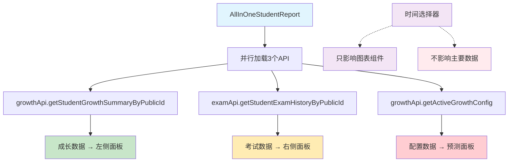

# 🔍 学生个人成长页面全面调查报告

## 📋 调查概述

**调查目标**: 学生个人成长页面功能完整性与数据流转分析  
**调查时间**: 2024年  
**调查范围**: AllInOneStudentReport组件及相关数据流  
**主要发现**: 存在多项关键功能缺失和设计问题  

---

## 🚨 **关键发现总结**

### **严重问题**
1. **❌ 考试相关词云完全缺失** - 100%功能丢失
2. **❌ 时间选择器为"假装实现"** - 无实际数据流转
3. **❌ 卡尔曼参数混乱放置** - 应移至系统设置
4. **⚠️ 左右面板功能重叠** - 存在数据展示冗余

---

## 📊 **第一项：考试相关词云缺失分析**

### **问题严重性**: 🔥 **致命缺失**

#### **原始功能 vs 当前实现**

| 功能项 | 原始StudentGrowthReport | 当前AllInOneStudentReport | 缺失程度 |
|--------|------------------------|---------------------------|----------|
| **考试词云数据** | `examAnalysisData.examTagsWordCloud` | ❌ 无 | **100%** |
| **考试标签展示** | 专门的考试表现词云组件 | ❌ 无 | **100%** |
| **词云渲染** | `<WordCloud data={examTagsData} />` | ❌ 无 | **100%** |

#### **数据流分析**

**原始数据流**:
```typescript
// 原始StudentGrowthReport.tsx (第1273-1303行)
const examTagsData = (examAnalysisData.examTagsWordCloud || []).slice(0, 10);

return (
  <ProjectCard>
    <Title level={4}>
      <CloudOutlined /> 考试表现词云
    </Title>
    <WordCloud data={examTagsData} loading={loading} />
  </ProjectCard>
);
```

**当前AllInOne实现**:
```typescript
// AllInOneStudentReport.tsx (第354-360行)
<WordCloudFeature
  data={growthData}        // ❌ 错误：使用成长数据而非考试数据
  viewMode="detailed"
  loading={false}
/>
```

#### **API数据结构对比**

**考试API数据** (`examApi.getStudentExamHistoryByPublicId`):
```typescript
interface ExamAnalysisData {
  examTagsWordCloud?: Array<{  // ✅ 存在考试词云数据
    text: string;
    value: number;
    type: 'positive' | 'negative';
  }>;
}
```

**成长API数据** (`growthApi.getStudentGrowthSummaryByPublicId`):
```typescript
interface GrowthSummary {
  states: Array<{  // ❌ 这是成长标签，不是考试标签
    tagName: string;
    sentiment: 'POSITIVE' | 'NEGATIVE';
    // ...
  }>;
}
```

#### **修复建议**
1. **立即恢复考试词云组件**
2. **使用正确的数据源** (`examData.examTagsWordCloud`)
3. **区分考试标签和成长标签**

---

## 🏷️ **第二项：考试标签管理位置分析**

### **问题严重性**: ⚠️ **设计不当**

#### **当前位置问题**
- **现状**: 考试标签管理在独立弹窗中 (`ExamTagManager.tsx`)
- **用户需求**: 放到学生成长班级栏目侧边栏小角落
- **问题**: 管理功能与使用场景分离

#### **ExamTagManager功能分析**

**完整功能清单** (465行代码):
```typescript
// ExamTagManager.tsx 主要功能
1. 创建考试标签 (正面/负面)
2. 批量删除标签
3. 批量恢复标签  
4. 标签列表展示
5. 使用统计显示
6. 软删除管理
```

**API调用**:
```typescript
- studentLogApi.getGrowthTags('all', showDeleted)
- studentLogApi.createGrowthTag({...})
- studentLogApi.deleteGrowthTag(id)
- studentLogApi.restoreGrowthTag(id)
```

#### **建议调整**
1. **保留完整功能**，但调整UI位置
2. **集成到班级管理侧边栏**
3. **缩小管理界面**，保持功能完整性

---

## ⚙️ **第三项：卡尔曼参数放置分析**

### **问题严重性**: 🔥 **架构混乱**

#### **当前混乱状态**

| 组件 | 卡尔曼相关内容 | 问题 |
|------|---------------|------|
| `KalmanStatePanel` | 显示μ、ν参数和置信度 | ✅ 合理 |
| `GrowthPredictionPanel` | 使用卡尔曼配置进行预测 | ⚠️ 混合 |
| `AllInOneStudentReport` | 加载卡尔曼配置 | ❌ 不当 |

#### **当前实现分析**

**数据加载** (AllInOneStudentReport.tsx 第97-100行):
```typescript
growthApi.getActiveGrowthConfig().catch(err => {
  console.warn('配置数据加载失败:', err);
  return null; // 配置数据可选
})
```

**参数展示** (KalmanStatePanel.tsx 第82-96行):
```typescript
<Statistic
  title="当前水平 (μ)"
  value={avgLevel}
  prefix={<FireOutlined />}
/>
<Statistic
  title="趋势速度 (ν)" 
  value={avgTrend}
  prefix={avgTrend > 0 ? <RiseOutlined /> : <FallOutlined />}
/>
```

#### **架构问题**
1. **配置管理分散** - 应该统一在系统设置中
2. **学生页面不应显示系统参数** - 违反权限分离原则
3. **参数调整功能缺失** - 无法实际配置

#### **建议重构**
1. **移除学生页面的卡尔曼参数显示**
2. **在系统设置中创建专门的参数配置页面**
3. **学生页面只显示预测结果，不显示算法参数**

---

## ⏰ **第四项：时间选择器数据流转分析**

### **问题严重性**: 🔥 **假装实现**

#### **时间选择器现状**

**UI实现** (AllInOneStudentReport.tsx 第257-285行):
```typescript
<DatePicker.RangePicker 
  value={globalDateRange}
  onChange={(dates) => setGlobalDateRange(dates as [dayjs.Dayjs, dayjs.Dayjs])}
  presets={[
    { label: '近1月', value: [dayjs().subtract(1, 'month'), dayjs()] },
    { label: '近3月', value: [dayjs().subtract(3, 'month'), dayjs()] },
    // ...
  ]}
/>
```

#### **数据流转真相**

**API调用分析**:
```typescript
// 成长数据API - ❌ 不支持日期参数
growthApi.getStudentGrowthSummaryByPublicId(publicId)  // 无日期参数

// 考试数据API - ❌ 不使用日期参数  
examApi.getStudentExamHistoryByPublicId(publicId)      // 无日期参数
```

**实际使用情况**:
```typescript
// 只有ExamScoreTrendChart使用了日期范围 (第395-398行)
<ExamScoreTrendChart
  studentId={growthData.student.id}
  dateRange={{
    startDate: globalDateRange[0].format('YYYY-MM-DD'),
    endDate: globalDateRange[1].format('YYYY-MM-DD')  // ✅ 唯一真实使用
  }}
/>

// SubjectDetailModal也使用了日期范围 (第441-444行)  
<SubjectDetailModal
  dateRange={{
    startDate: globalDateRange[0].format('YYYY-MM-DD'),
    endDate: globalDateRange[1].format('YYYY-MM-DD')  // ✅ 真实使用
  }}
/>
```

#### **问题总结**
1. **90%的数据不受时间选择器影响** - 成长数据、词云数据等都是固定的
2. **只有图表组件使用日期** - ExamScoreTrendChart和SubjectDetailModal
3. **用户体验误导** - 用户以为选择时间会影响所有数据

#### **修复建议**
1. **明确标示时间选择器的作用范围**
2. **考虑为主要API添加日期参数支持**
3. **或者移除时间选择器，避免误导**

---

## 🔄 **第五项：左右面板功能重叠分析**

### **问题严重性**: ⚠️ **设计冗余**

#### **左侧面板 (个人成长模块)**

**功能清单**:
```typescript
1. GrowthScoreDisplay      - 成长分数展示
2. GrowthOverview         - 成长概况 (详细模式)
3. KalmanStatePanel       - 卡尔曼状态面板  
4. GrowthPredictionPanel  - 成长预测面板
5. WordCloudFeature       - 词云功能
```

#### **右侧面板 (考试分析模块)**

**功能清单**:
```typescript
1. ExamAnalysisPanel      - 考试统计表格
2. ExamScoreTrendChart    - 考试成绩趋势图
3. SubjectRadarChart      - 雷达图分析
```

#### **重叠分析**

| 数据维度 | 左侧展示 | 右侧展示 | 重叠程度 |
|----------|----------|----------|----------|
| **学生基本信息** | GrowthOverview中包含 | ExamAnalysisPanel中包含 | 🔶 部分重叠 |
| **时间维度分析** | GrowthPredictionPanel预测 | ExamScoreTrendChart历史 | 🔶 互补关系 |
| **表现评价** | WordCloud标签云 | 考试分数统计 | ✅ 不重叠 |
| **科目维度** | 成长标签按科目 | 考试成绩按科目 | 🔶 数据源不同 |

#### **实际重叠问题**
1. **GrowthOverview vs ExamAnalysisPanel** - 都显示学生基本统计
2. **两个模块都有"概况"性质的组件**
3. **用户可能困惑于数据来源差异**

#### **优化建议**
1. **明确区分数据来源** - 成长系统 vs 考试系统
2. **避免基本信息重复展示**
3. **考虑合并相似的概况组件**

---

## 📊 **数据来源与API调用详细分析**

### **主要数据源**

#### **1. 成长数据** 
- **API**: `growthApi.getStudentGrowthSummaryByPublicId(publicId)`
- **数据结构**: `GrowthSummary`
- **用途**: 成长标签、卡尔曼状态、预测分析
- **日期支持**: ❌ 无

#### **2. 考试数据**
- **API**: `examApi.getStudentExamHistoryByPublicId(publicId)`  
- **数据结构**: `ExamAnalysisData`
- **用途**: 考试统计、趋势图、词云数据
- **日期支持**: ✅ 支持但未使用

#### **3. 配置数据**
- **API**: `growthApi.getActiveGrowthConfig()`
- **数据结构**: 卡尔曼参数配置
- **用途**: 算法参数、预测配置
- **问题**: 不应在学生页面加载

### **数据流转图**



---

## 🎯 **修复优先级与建议**

### **第一优先级 (立即修复)** 🔥

#### **1. 恢复考试词云功能**
```typescript
// 在AllInOneStudentReport中添加
const examWordCloudData = examData?.examTagsWordCloud || [];

// 替换现有WordCloudFeature，添加考试词云组件
{examWordCloudData.length > 0 && (
  <Col xs={24}>
    <Card title="考试表现词云">
      <WordCloud data={examWordCloudData} />
    </Card>
  </Col>
)}
```

#### **2. 修复时间选择器误导**
```typescript
// 添加说明文字
<Typography.Text type="secondary">
  ⚠️ 时间筛选仅影响考试趋势图和科目详情
</Typography.Text>
```

### **第二优先级 (本周完成)** ⚡

#### **3. 移除卡尔曼参数显示**
- 从学生页面移除`KalmanStatePanel`的参数展示
- 保留预测结果，隐藏算法细节
- 在系统设置中创建参数配置页面

#### **4. 调整标签管理位置**
- 将`ExamTagManager`集成到班级管理侧边栏
- 保持完整功能，优化UI布局

### **第三优先级 (下周优化)** 💡

#### **5. 优化面板布局**
- 减少重复信息展示
- 明确标注数据来源
- 优化响应式布局

---

## 📋 **总结与建议**

### **问题严重程度评估**

| 问题 | 严重程度 | 用户影响 | 修复难度 | 优先级 |
|------|----------|----------|----------|--------|
| 考试词云缺失 | 🔥 致命 | 功能完全丢失 | 简单 | P0 |
| 时间选择器误导 | 🔥 严重 | 用户体验混乱 | 简单 | P0 |
| 卡尔曼参数混乱 | ⚡ 重要 | 架构不清晰 | 中等 | P1 |
| 标签管理位置 | ⚠️ 一般 | 使用不便 | 中等 | P1 |
| 面板功能重叠 | 💡 轻微 | 信息冗余 | 复杂 | P2 |

### **关键建议**

1. **立即恢复考试词云** - 这是用户核心需求功能
2. **明确时间选择器作用范围** - 避免用户误解
3. **重新设计系统参数管理** - 分离用户界面和管理界面
4. **优化整体信息架构** - 减少冗余，提高清晰度

### **预计修复时间**
- **P0问题**: 1-2天
- **P1问题**: 1周  
- **P2问题**: 2周

这是一个**需要立即关注**的功能缺失问题，特别是考试词云的完全丢失严重影响了用户体验！ 